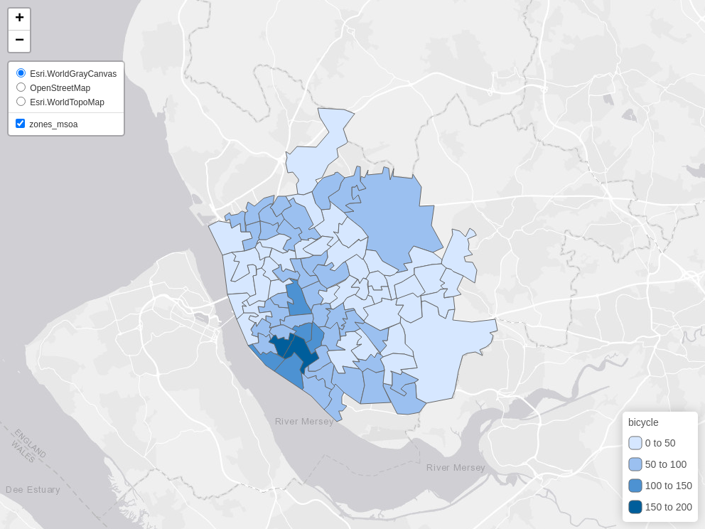

# Origin-destination data to route networks workflows

The aim of this document is to demonstrate how to convert
Origin-Destination data to route networks. The data for this is from the
[wicid](https://wicid.ukdataservice.ac.uk/flowdata/cider/wicid/downloads.php)
website.

You can download datasets at multiple geographic levels from that
website. We will start with the open MSOA to MSOA dataset.

The study location can be defined as follows:

``` r
study_location_name = "Alder Hey Children's Hospital"
study_location_coodinates = tmaptools::geocode_OSM(study_location_name)$coords
study_location_coodinates
```

            x         y 
    -2.896989 53.419608 

``` r
study_location_df = data.frame(name = study_location_name, lon = study_location_coodinates[1], lat = study_location_coodinates[2])
study_location_sf = sf::st_as_sf(study_location_df, coords = c("lon", "lat"), crs = 4326)
buffer_distance = 5000
study_location_buffer = sf::st_buffer(study_location_sf, buffer_distance)
```

For the MSOA data we will get data from the `pct` R package as follows:

``` r
msoa_data = pct::get_pct(layer = "z", geography = "msoa", national = TRUE)
```

We will also get population weighted centroids for the MSOA data:

``` r
msoa_centroids = pct::get_pct(layer = "c", geography = "msoa", national = TRUE)
```

Let’s find the administrative zones the centroids of which are within
the buffer:

``` r
centroids_msoa = msoa_centroids[study_location_buffer, ]
zones_msoa = msoa_data |>
  filter(geo_code %in% centroids_msoa$geo_code)
```

We can visualise the results as follows:

``` r
m = tm_shape(zones_msoa) +
  tm_polygons("bicycle")
tmap_save(m, "msoa_zones.html")
browseURL("msoa_zones.html")
```



Let’s subset the data that originates in the study location and which
goes the the MSOA within which the study location is located:

``` r
zone_study_area = zones_msoa[study_location_sf, ]
u_od_msoa = "https://s3-eu-west-1.amazonaws.com/statistics.digitalresources.jisc.ac.uk/dkan/files/FLOW/wu03ew_v2/wu03ew_v2.zip"
f_od_msoa = basename(u_od_msoa)
if(!file.exists(f_od_msoa)) {
  download.file(u_od_msoa, f_od_msoa)
  unzip(f_od_msoa)
}
od_all = read_csv("wu03ew_v2.csv")
od_msoa = od_all |>
  filter(`Area of residence` %in% zones_msoa$geo_code) |>
  filter(`Area of workplace` %in% zone_study_area$geo_code)
```

We can plot the resulting OD data as follows:

``` r
desire_lines = od::od_to_sf(od_msoa, zones_msoa)
tm_shape(desire_lines) +
  tm_lines()
```


We’ll save the MSOA data as follows:

``` r
write_csv(od_msoa, "od_msoa.csv")
sf::write_sf(zones_msoa, "zones_msoa.geojson")
sf::write_sf(desire_lines, "desire_lines.geojson")
sf::write_sf(centroids_msoa, "centroids_msoa.geojson")
sf::write_sf(study_location_buffer, "study_location_buffer.geojson")
sf::write_sf(study_location_sf, "study_location.geojson")
```
