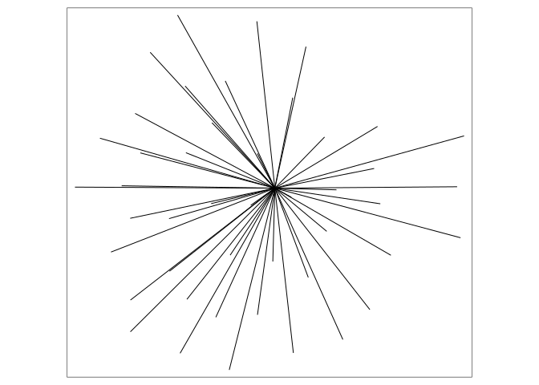
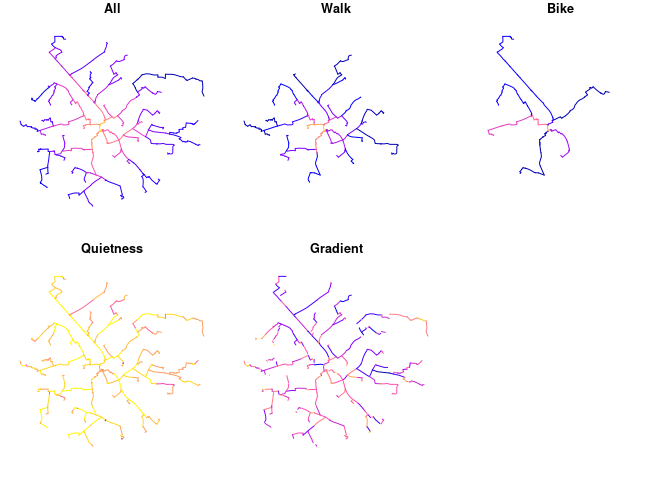
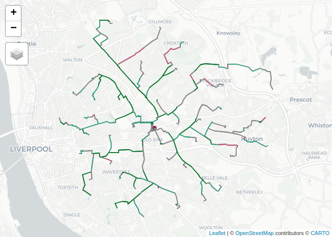
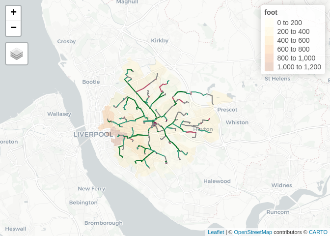

# Origin-destination data to route networks workflows

The aim of this document is to demonstrate how to convert
Origin-Destination data to route networks. The data for this is from the
[wicid](https://wicid.ukdataservice.ac.uk/flowdata/cider/wicid/downloads.php)
website.

You can download datasets at multiple geographic levels from that
website. We will start with the open MSOA to MSOA dataset.

The study location can be defined as follows:

``` r
study_location_name = "Alder Hey Children's Hospital"
study_location_coodinates = tmaptools::geocode_OSM(study_location_name)$coords
study_location_coodinates
```

            x         y 
    -2.896989 53.419608 

``` r
study_location_df = data.frame(name = study_location_name, lon = study_location_coodinates[1], lat = study_location_coodinates[2])
study_location_sf = sf::st_as_sf(study_location_df, coords = c("lon", "lat"), crs = 4326)
buffer_distance = 5000
study_location_buffer = sf::st_buffer(study_location_sf, buffer_distance)
```

For the MSOA data we will get data from the `pct` R package as follows:

``` r
msoa_data = pct::get_pct(layer = "z", geography = "msoa", national = TRUE)
```

We will also get population weighted centroids for the MSOA data:

``` r
msoa_centroids = pct::get_pct(layer = "c", geography = "msoa", national = TRUE)
```

Let’s find the administrative zones the centroids of which are within
the buffer:

``` r
centroids_msoa = msoa_centroids[study_location_buffer, ]
zones_msoa = msoa_data |>
  filter(geo_code %in% centroids_msoa$geo_code)
```

We can visualise the results as follows:

``` r
m = tm_shape(zones_msoa) +
  tm_polygons("bicycle")
tmap_save(m, "msoa_zones.html")
browseURL("msoa_zones.html")
```


Let’s subset the data that originates in the study location and which
goes the the MSOA within which the study location is located:

``` r
zone_study_area = zones_msoa[study_location_sf, ]
u_od_msoa = "https://s3-eu-west-1.amazonaws.com/statistics.digitalresources.jisc.ac.uk/dkan/files/FLOW/wu03ew_v2/wu03ew_v2.zip"
f_od_msoa = basename(u_od_msoa)
if(!file.exists(f_od_msoa)) {
  download.file(u_od_msoa, f_od_msoa)
  unzip(f_od_msoa)
}
od_all = read_csv("wu03ew_v2.csv")
od_msoa = od_all |>
  filter(`Area of residence` %in% zones_msoa$geo_code) |>
  filter(`Area of workplace` %in% zone_study_area$geo_code)
```

We can plot the resulting OD data as follows:

``` r
desire_lines = od::od_to_sf(od_msoa, zones_msoa)
tm_shape(desire_lines) +
  tm_lines()
```



We’ll save the MSOA data as follows:

``` r
write_csv(od_msoa, "od_msoa.csv")
sf::write_sf(zones_msoa, "zones_msoa.geojson", delete_dsn = TRUE)
sf::write_sf(desire_lines, "desire_lines.geojson", delete_dsn = TRUE)
sf::write_sf(centroids_msoa, "centroids_msoa.geojson", delete_dsn = TRUE)
sf::write_sf(study_location_buffer, "study_location_buffer.geojson", delete_dsn = TRUE)
sf::write_sf(study_location_sf, "study_location.geojson", delete_dsn = TRUE)
```

Let’s calculate routes for each OD pair:

``` r
routes_msoa = stplanr::route(l = desire_lines, route_fun = cyclestreets::journey, plan = "quietest")
sf::write_sf(routes_msoa, "routes_msoa.geojson", delete_dsn = TRUE)
```

We’ll read-in the pre-saved routes as follows.

``` r
routes_msoa = sf::read_sf("routes_msoa.geojson")
```

``` r
names(routes_msoa)
```

     [1] "Area of residence"                       
     [2] "Area of workplace"                       
     [3] "All categories: Method of travel to work"
     [4] "Work mainly at or from home"             
     [5] "Underground, metro, light rail, tram"    
     [6] "Train"                                   
     [7] "Bus, minibus or coach"                   
     [8] "Taxi"                                    
     [9] "Motorcycle, scooter or moped"            
    [10] "Driving a car or van"                    
    [11] "Passenger in a car or van"               
    [12] "Bicycle"                                 
    [13] "On foot"                                 
    [14] "Other method of travel to work"          
    [15] "route_number"                            
    [16] "id"                                      
    [17] "time"                                    
    [18] "busynance"                               
    [19] "quietness"                               
    [20] "signalledJunctions"                      
    [21] "signalledCrossings"                      
    [22] "name"                                    
    [23] "walk"                                    
    [24] "elevations"                              
    [25] "distances"                               
    [26] "type"                                    
    [27] "legNumber"                               
    [28] "distance"                                
    [29] "turn"                                    
    [30] "startBearing"                            
    [31] "color"                                   
    [32] "provisionName"                           
    [33] "start"                                   
    [34] "finish"                                  
    [35] "start_longitude"                         
    [36] "start_latitude"                          
    [37] "finish_longitude"                        
    [38] "finish_latitude"                         
    [39] "crow_fly_distance"                       
    [40] "event"                                   
    [41] "whence"                                  
    [42] "speed"                                   
    [43] "itinerary"                               
    [44] "plan"                                    
    [45] "note"                                    
    [46] "length"                                  
    [47] "west"                                    
    [48] "south"                                   
    [49] "east"                                    
    [50] "north"                                   
    [51] "leaving"                                 
    [52] "arriving"                                
    [53] "grammesCO2saved"                         
    [54] "calories"                                
    [55] "edition"                                 
    [56] "gradient_segment"                        
    [57] "elevation_change"                        
    [58] "gradient_smooth"                         
    [59] "geometry"                                

``` r
library(sf)
attrib = c("Bicycle", "On foot", "gradient_smooth", "quietness", "All categories: Method of travel to work")
routes_msoa_minimal = routes_msoa[, attrib] |> 
  mutate(quietness = as.numeric(quietness))
rnet_msoa_raw = stplanr::overline(routes_msoa_minimal, attrib = attrib, fun = list(sum = sum, mean = mean))
rnet_msoa_quiet = rnet_msoa_raw |> 
  transmute(All = `All categories: Method of travel to work_sum`, Walk = `On foot_sum`, Bike = Bicycle_sum, Quietness = quietness_mean, Gradient = gradient_smooth_mean)
sf::write_sf(rnet_msoa_quiet, "rnet_msoa_quiet.geojson", delete_dsn = TRUE)
plot(rnet_msoa_quiet, logz = TRUE)
```



We’ll create an interactive map of the outputs as follows, building on
the CRUSE project:

``` r
remotes::install_github("ITSLeeds/netvis")
basemaps = c(
  `Grey basemap` = "CartoDB.Positron",
  `Coloured basemap` = "Esri.WorldTopoMap"
  # `Cycleways (OSM)` = "https://b.tile-cyclosm.openstreetmap.fr/cyclosm/{z}/{x}/{y}.png",
  # `Satellite image` = "https://server.arcgisonline.com/ArcGIS/rest/services/World_Imagery/MapServer/tile/{z}/{y}/{x}'"
)
popup_vars = c(
  "Cycle friendliness" = "Quietness",
  "Gradient" = "Gradient"
)
quietness_palette = pal = c('#882255','#CC6677', '#44AA99', '#117733')
map_rnet = netvis::netvis(
  rnet_msoa_quiet,
  width_regex = "Bik|Walk",
  popup_vars = popup_vars,
  width_var_name = "Bicycle trips",
  col = "Quietness",
  pal = pal,
  basemaps = basemaps,
  legend.col.show = FALSE,
  output = "tmap"
  )
tmap_mode("view")
map_rnet
```



``` r
m_combined = tm_shape(zones_msoa, name = "Zones (MSOA)") +
  tm_fill("foot", alpha = 0.2) +
  map_rnet 
m_combined
```



``` r
tmap_save(m_combined, "m_combined_cyclestreets.html")
```
